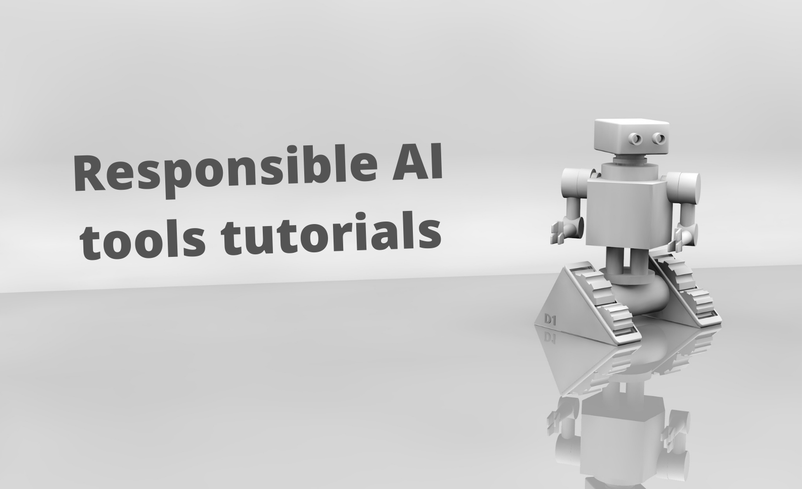

# Responsible AI tools tutorials

This repository contains hands-on tutorials for Microsoft's most prominent Responsible AI tools.
It is primarily designed for developers and data scientists to provide them with jump-start for using each tool in the form of jupyter notebooks. 

Responsible AI is still an underrated subject among data scientists and AI practicionners more broadly and today a huge gap between principles and practices exists when it comes to implementing AI systems in a more responsible manner. These tutorials are meant to accompagny the whitepaper "Putting Responsible AI into practice" which tackles exactly this issue and can be found under the whitepaper folder.

## Overview of the available hands-on tutorials

We investigate three categories of Responsible AI tools:

* Tools to understand the behaviour of AI systems. These in turn fall into two categories:
    - Tools to assess and mitigate fairness issues. Here we focus on **Fairlearn**.
    - Tools to understand and explain AI systems predictions. Here we focus on **InterpretML** and **Error Analysis**.
* Tools to protect AI systems data: 
    - Data anonymization using **Presidio**.
    - Differential privacy with the **SmartNoise** system.
* Dashboards and user interfaces grouping such Responsible AI tools together under a single roof. Here we will look at **Responsible-AI-Widgets**.
